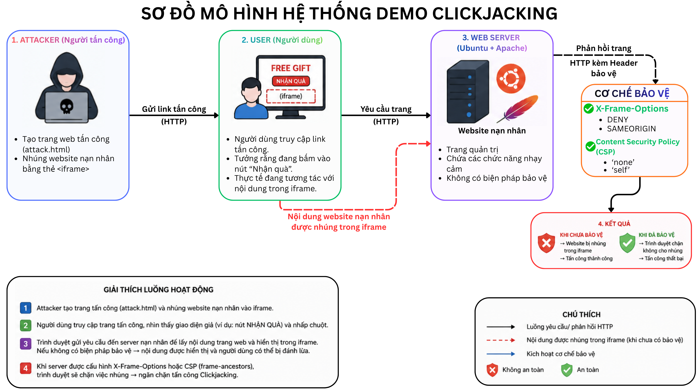
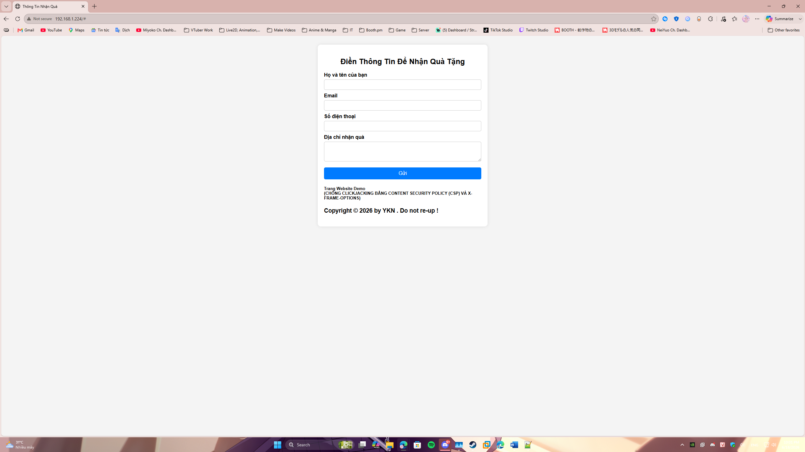
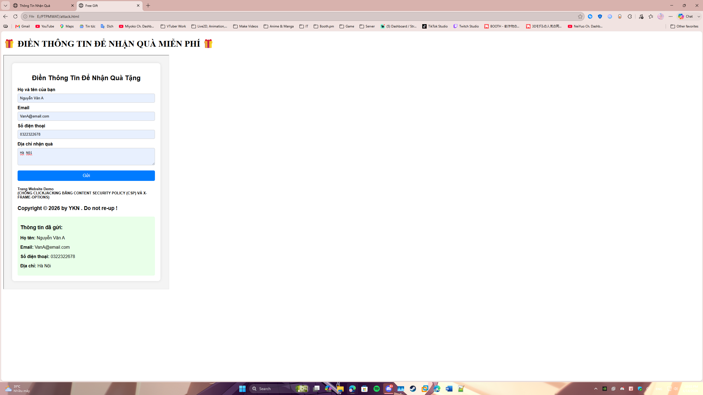
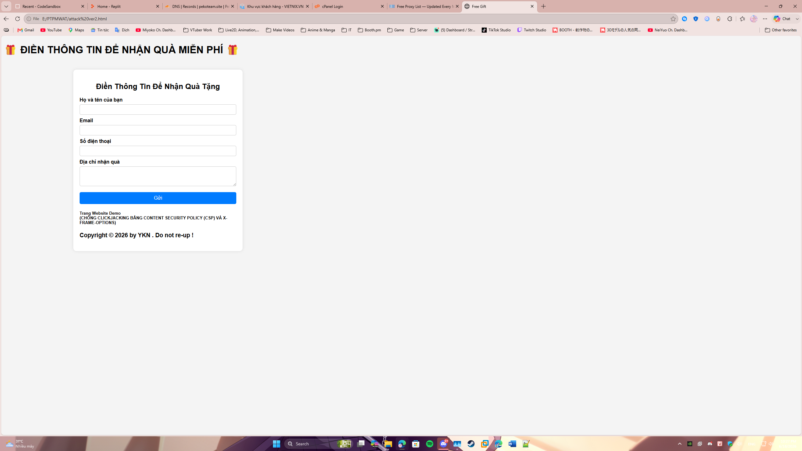
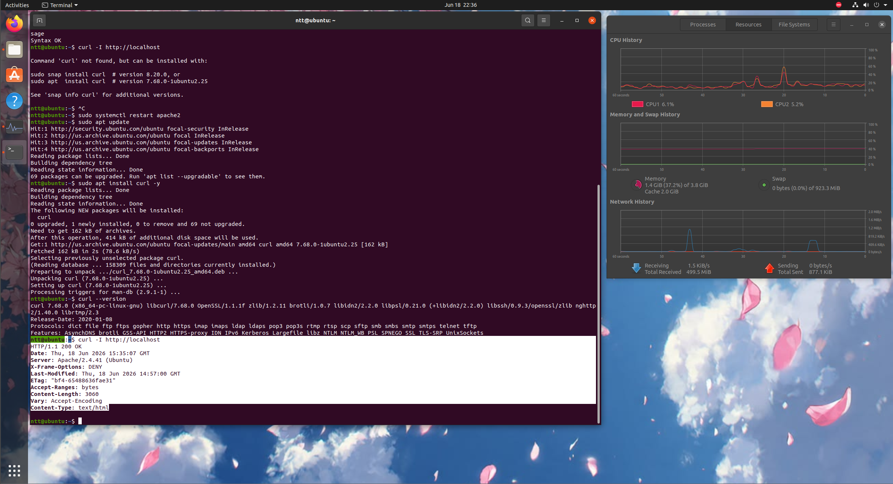
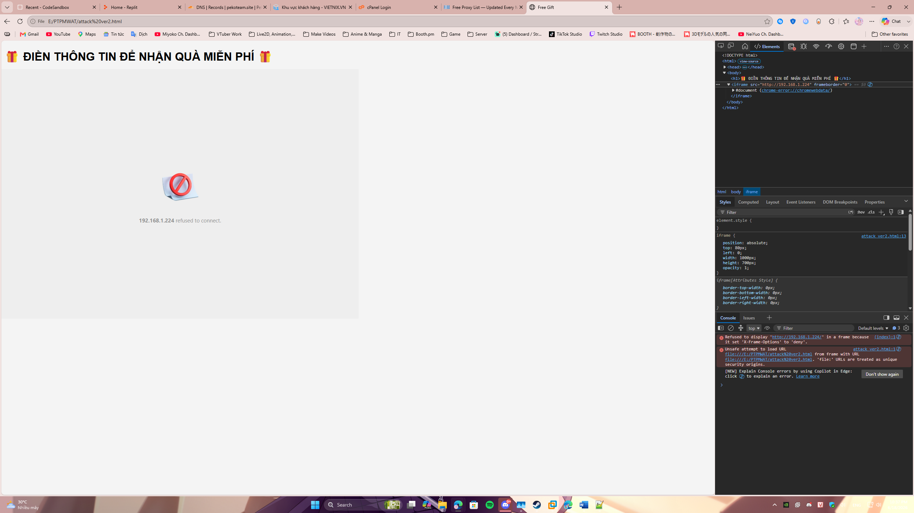

# 📝 BÁO CÁO CHUYÊN ĐỀ HỌC PHẦN
# PHÁT TRIẺN PHẦN MỀM WEB AN TOÀN

---

### **📄Thông tin đề tài**

- **Tên đề tài :** CHỐNG CLICKJACKING BẰNG COTENT SECURITY POLICY (CSP) & X-FRAME-OPTIONS – DEMO TẤN CÔNG VÀ CÁCH FIX
- **Giảng viên hướng dẫn :** CẤN ĐỨC ĐIỆP
- **Ngành :** CÔNG NGHỆ THÔNG TIN
- **Chuyên ngành :** CÔNG NGHỆ PHẦN MỀM
- **Lớp :** D19CNTT1B
- **Khóa :** 2024-2027

---

### **🧑‍💻 Thông tin các thành viên trong nhóm**

- **Nhóm trưởng :** Nguyễn Trần Tài
- **Thành viên 1 :** Hoàng Đức Anh
- **Thành viên 2 :** Nguyễn Danh Thái
- **Thành viên 3 :** Trần Thiên Thành
- **Thành viên 4 :** Nguyễn Vũ Thái
  
### **🔎 Nhiệm vụ của từng thành viên**

| Tên thành viên | Nhiệm vụ chính |
|-----------------|----------------|
| Nguyễn Trần Tài  | Lập trình, thiết kế trang web, chuẩn bị máy ảo cho Demo chương trình và đưa ra báo cáo cho nhóm |
| Hoàng Đức Anh    | Xây dựng, thiết kế, chỉnh sửa và hoàn thiện báo cáo của nhóm |
| Nguyễn Danh Thái | [ Đang sắp xếp ] |
| Trần Thiên Thành | [ Đang sắp xếp ] |
| Nguyễn Vũ Thái   | [ Đang sắp xếp ] |

---

### **🖥️ Môi trường sử dụng**

| Thành phần | Phiên bản sử dụng |
|-----------------|----------------|
| Ubuntu    | Ubuntu 20.04 LTS |
| Apache    | 2.4 |
| Browser   | Microsoft Edge |
| IDE       | VS Code |
| VMware    | Workstation 17 Pro (17.5.0 build-22583795) |
| HTML      | HTML5 |
| CSS       | CSS3 |

---

### **🖼️ Danh sách hình ảnh trong đề tài**

**Hình 1: Sơ đồ mô hình hệ thống demo Clickjacking:**

=

**Hình 2: Website nạn nhân:**

=

**Hình 3: Website bị nhúng trong iframe:**

=

**Hình 4: Mô phỏng Clickjacking:**

=

**Hình 5: Header X-Frame-Options:**

=

**Hình 6: Trình duyệt Microsoft Edge thực thi chỉ thị DENY và chặn đứng hoàn toàn mã độc nhúng trang:**

